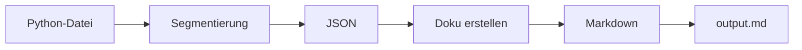

# Code-Erklärer

Ein **ultra-einfaches, lineares** Python-Skript, das deinen Python-Quellcode in **logische Segmente** aufteilt und **jedes Segment von der ChatGPT-API erklären lässt**. Ergebnis ist ein **sauber formatiertes Markdown-Dokument** mit Inhaltsverzeichnis.

## Features

* 🔀 **Zwei Schritte in einem Lauf**:

  1. Segmentierung des gesamten Codes → JSON
  2. Erklärung jedes Segments → Markdown-Kapitel
* 🧭 **Inhaltsverzeichnis** mit Anker-Links
* 🧱 **Kompakte Erklärungen** mit Abschnitten: Erklärung, Besonderheiten/Randfälle, Hinweise, Schnittstellen
* 🧩 **Modell & Temperatur per ENV** konfigurierbar
* 📝 **Einfacher Output**: eine einzige `.md`-Datei

## Schnellstart

```bash
# 1) Abhängigkeiten
pip install openai python-dotenv

# 2) API-Key setzen (oder per .env)
export OPENAI_API_KEY="sk-..."

# optional: Modell wählen
export OPENAI_MODEL="gpt-4o-mini"
export OPENAI_TEMPERATURE="0.2"

# 3) Skript ausführen
python segment_and_explain_linear.py path/to/your_code.py path/to/output.md
```

* **Input:** Eine Python-Datei (`your_code.py`)
* **Output:** Ein Markdown-Dokument (`output.md`) mit Erklärungen pro Segment

## Ablauf (überblick)



## CLI

```bash
python segment_and_explain_linear.py <pfad_zur_datei.py> <output.md>
```

* Beendet sich mit Hinweis auf den Zielpfad, wenn erfolgreich.
* Läuft strikt linear (keine Nebenprozesse, kein Retry-Mechanismus).

## Konfiguration

Über Umgebungsvariablen oder `.env`:

* `OPENAI_API_KEY` **(Pflicht)** – dein API-Key
* `OPENAI_MODEL` *(optional)* – z. B. `gpt-4o-mini` (Default)
* `OPENAI_TEMPERATURE` *(optional)* – z. B. `0.2` (präziser Stil)

Beispiel `.env`:

```ini
OPENAI_API_KEY=sk-...
OPENAI_MODEL=gpt-4o-mini
OPENAI_TEMPERATURE=0.2
```

## Output-Struktur

`output.md` enthält:

* `# Erklärung des Codes` (Header + kurze Einleitung)
* `## Inhalt` (TOC mit Anker-Links)
* Für **jedes Segment**:

  * `### {n}. {Titel}`
  * ein kleiner Codeblock-Platzhalter
  * **Erklärung**
  * **Besonderheiten & Randfälle**
  * **Hinweise**
  * **Schnittstellen**
* Footer mit Zeitstempel, Modell, Temperatur und Segmentanzahl

## Performance

* Es werden **9 API-Calls** bei 8 Segmenten (1× Segmentierung + 8× Erklärung) ausgelöst.
* Laufzeit ≈ *Summe der API-Antwortzeiten*. Für `gpt-4o-mini` häufig **~10–20 s**, je nach Codegröße/Segmentanzahl auch länger.

## Sicherheit / Kosten

* **API-Key nicht commiten.** Nutze `.env` und füge sie zu `.gitignore` hinzu.
* Jeder Aufruf erzeugt **Token-Kosten**. Kürzere Segmente und geringere `max_tokens` reduzieren Kosten.
* Enthält dein Code **sensible Daten**, prüfe vor dem Senden an die API.

## Ordnerstruktur (Vorschlag)

```
.
├─ segment_and_explain_linear.py
├─ README.md
├─ .env                 # niemals committen
└─ examples/
   ├─ demo_input.py
   └─ demo_output.md
```

## Typische Fragen (FAQ)

**Warum zwei Schritte?**
Segmentierung und Erklärung sind unterschiedliche Aufgaben mit unterschiedlichen Prompts. So bleiben die Erklärungen pro Segment präzise und referenzieren den genauen Code-Block.

**Kann ich das Modell ändern?**
Ja, per `OPENAI_MODEL`. Für Geschwindigkeit kannst du Varianten wie `gpt-4o-mini-fast` testen.

**Kann ich Zeit/Token sparen?**
Ja – kürzere Segmente, konservative `max_tokens` in den API-Calls (im Skript auf ~900 gesetzt), und ggf. weniger Detailtiefe im Prompt.

**Was, wenn die Segmentierung mal ungenau ist?**
Da das Skript linear und minimal ist (ohne Error-Handling), passe ggf. den Segmentierungs-Prompt im Skript leicht an (z. B. strengere Segment-Hinweise).

**Gibt es eine Beispielausgabe?**
[`erklaerung.md`](erklaerung.md)
## Lizenz

Auf Anfrage

